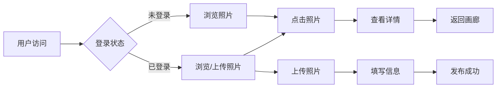

## 1. Product Overview
照片展览应用是一个优雅的在线图片展示平台，让用户能够浏览、欣赏和分享精美照片作品。
- 为摄影爱好者和普通用户提供沉浸式的图片浏览体验
- 支持照片分类展示、全屏查看和互动分享功能

## 2. Core Features

### 2.1 User Roles
| Role | Registration Method | Core Permissions |
|------|---------------------|------------------|
| Viewer |无需注册|浏览照片、查看详情、按分类筛选|
| Photographer |邮箱注册/登录|上传照片、管理作品、设置分类|

### 2.2 Feature Module
1. **首页/画廊页**: 照片网格展示、分类筛选、搜索功能
2. **照片详情页**: 全屏查看、照片信息、互动操作
3. **上传页**: 照片上传、信息填写、分类选择

### 2.3 Page Details
| Page Name | Module Name | Feature description |
|-----------|-------------|---------------------|
| 首页/画廊页 | 顶部导航 | Logo、搜索框、分类标签、用户入口 |
| 首页/画廊页 | 照片网格 | 响应式瀑布流布局，悬停预览效果 |
| 首页/画廊页 | 分类筛选 | 按类别、时间筛选照片 |
| 照片详情页 | 照片展示 | 高清大图展示、缩放功能 |
| 照片详情页 | 照片信息 | 标题、描述、摄影师、拍摄时间 |
| 上传页 | 上传组件 | 拖拽上传、图片预览、信息填写 |

## 3. Core Process

用户浏览流程：访问首页 → 浏览照片网格 → 点击照片查看详情 → 返回继续浏览

摄影师上传流程：登录 → 进入上传页 → 选择照片 → 填写信息 → 提交发布

## 4. User Interface Design

### 4.1 Design Style
- **主色调**: 深色主题 (#0f0f0f)，营造沉浸式浏览体验
- **辅助色**: 金色/琥珀色 (#f59e0b) 作为强调色，增添艺术感
- **按钮风格**: 圆角、极简、悬停时有优雅过渡效果
- **字体**: Playfair Display（标题）+ Inter（正文），经典与现代结合
- **布局风格**: 卡片式网格布局，大量留白突出照片本身
- **动画**: 平滑过渡、悬停缩放、页面加载渐进动画

### 4.2 Page Design Overview
| Page Name | Module Name | UI Elements |
|-----------|-------------|-------------|
| 首页/画廊页 | 顶部导航 | 深色背景、白色文字、搜索框圆角设计 |
| 首页/画廊页 | 照片网格 | 瀑布流布局、卡片阴影、悬停放大效果 |
| 首页/画廊页 | 分类标签 | 胶囊形状、选中状态高亮 |
| 照片详情页 | 照片展示 | 全屏黑色背景、导航箭头、缩放按钮 |
| 照片详情页 | 信息面板 | 底部滑入式面板、渐变遮罩 |
| 上传页 | 上传区域 | 虚线边框、拖拽提示、预览缩略图 |

### 4.3 Responsiveness
- **桌面端**: 4-5列网格布局
- **平板端**: 3列网格布局
- **移动端**: 2列网格布局，底部导航栏

### 4.4 交互设计
- 照片悬停时显示半透明遮罩和查看按钮
- 点击照片平滑过渡到详情页
- 详情页支持键盘左右切换
- 支持图片缩放查看细节