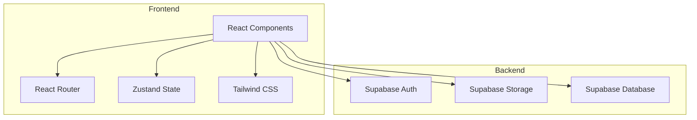
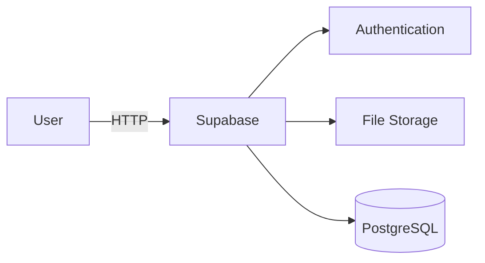
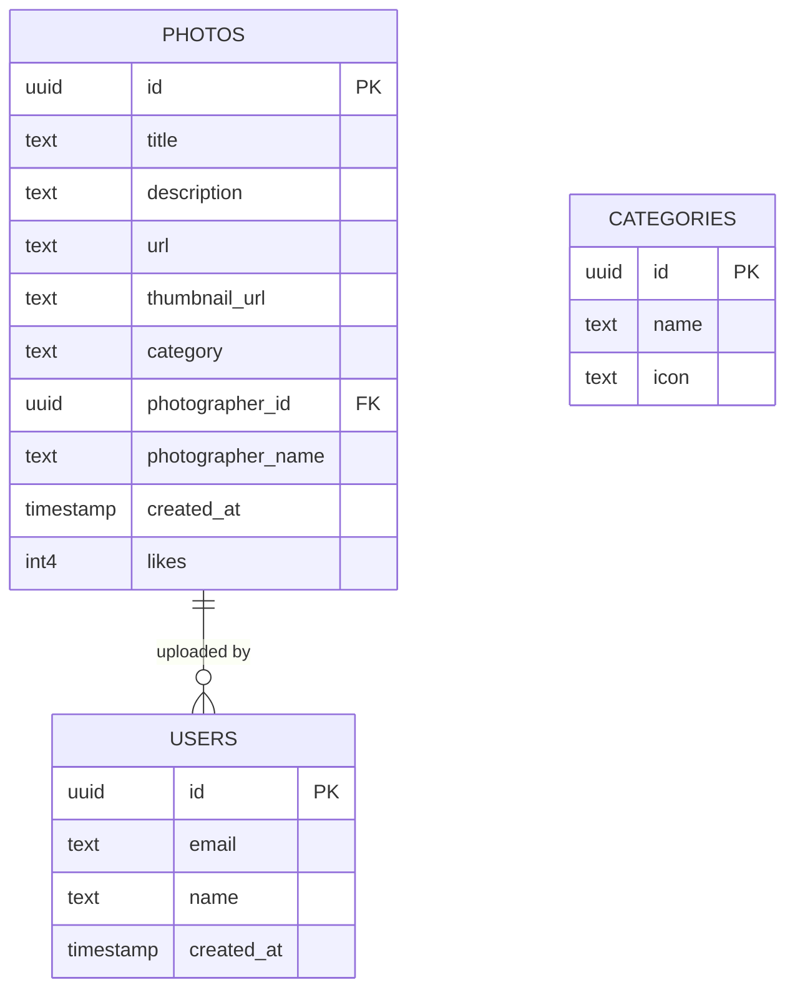

## 1. Architecture Design



## 2. Technology Description
- Frontend: React@18 + TypeScript + TailwindCSS@3 + Vite
- State Management: Zustand
- Routing: React Router DOM
- Backend: Supabase (Authentication, Storage, Database)
- Icons: Lucide React

## 3. Route Definitions
| Route | Purpose |
|-------|---------|
| / | 首页/画廊页，展示照片网格 |
| /photo/:id | 照片详情页，展示单张照片 |
| /upload | 照片上传页，摄影师上传作品 |
| /login | 登录页面 |

## 4. API Definitions

### 4.1 照片数据接口
使用 Supabase Client SDK 直接操作，无需额外后端 API。

### 4.2 数据类型定义
```typescript
interface Photo {
  id: string;
  title: string;
  description: string;
  url: string;
  thumbnailUrl: string;
  category: string;
  photographerId: string;
  photographerName: string;
  createdAt: string;
  likes: number;
}

interface Category {
  id: string;
  name: string;
  icon: string;
}
```

## 5. Server Architecture Diagram



## 6. Data Model

### 6.1 Data Model Definition


### 6.2 Data Definition Language

```sql
CREATE TABLE categories (
  id UUID PRIMARY KEY DEFAULT uuid_generate_v4(),
  name TEXT NOT NULL,
  icon TEXT
);

CREATE TABLE photos (
  id UUID PRIMARY KEY DEFAULT uuid_generate_v4(),
  title TEXT NOT NULL,
  description TEXT,
  url TEXT NOT NULL,
  thumbnail_url TEXT NOT NULL,
  category TEXT REFERENCES categories(name),
  photographer_id UUID REFERENCES auth.users(id),
  photographer_name TEXT,
  created_at TIMESTAMP DEFAULT NOW(),
  likes INT DEFAULT 0
);

INSERT INTO categories (name, icon) VALUES
('风景', 'mountain'),
('人物', 'user'),
('建筑', 'building'),
('动物', 'cat'),
('静物', 'flower');
```

### 6.3 RLS Policies

```sql
ALTER TABLE photos ENABLE ROW LEVEL SECURITY;

CREATE POLICY "Public can view all photos" ON photos
  FOR SELECT USING (true);

CREATE POLICY "Authenticated can upload photos" ON photos
  FOR INSERT WITH CHECK (auth.role() = 'authenticated');

CREATE POLICY "Owners can update their photos" ON photos
  FOR UPDATE USING (auth.uid() = photographer_id);

CREATE POLICY "Owners can delete their photos" ON photos
  FOR DELETE USING (auth.uid() = photographer_id);

GRANT SELECT ON photos TO anon;
GRANT ALL PRIVILEGES ON photos TO authenticated;
```